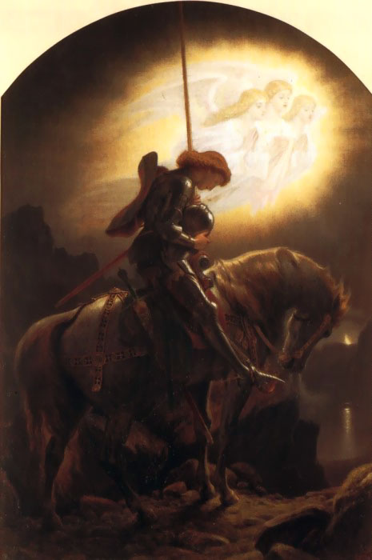

# Warrior
A short walk in time.

Bodybuilding is a side-effect of something more. Like Confidence, or Happiness, or Success, Bodybuilding will ensue from pursuit of things that are just out of your reach. [Viktor E. Frankl](https://en.wikipedia.org/wiki/Viktor_Frankl) wrote:

*Don't aim at success. The more you aim at it and make it a target, the more you are going to miss it. For success, like happiness, cannot be pursued; it must ensue, and it only does so as the unintended side effect of one's personal dedication to a cause greater than oneself or as the by-product of one's surrender to a person other than oneself. Happiness must happen, and the same holds for success: you have to let it happen by not caring about it. I want you to listen to what your conscience commands you to do and go on to carry it out to the best of your knowledge. Then you will live to see that in the long-run—in the long-run, I say! — success will follow you precisely because you had forgotten to think about it*

(Click image to watch video)

Warrior is the oldest name for it. Since out time in Green Africa we have progressed forward, and the word has changed, several times. But at each stage there are strong lessons to be learned, so let us step through the evolution of the warrior.

## The Hunter

This artwork has been with me for as long as I can remember, I found it in a book entitled “Wszechświat życie człowiek” (Universe, Life, Human) and one of my favorite writers Bill Bryson wrote something just as good [A Short History of Nearly Everything](https://en.wikipedia.org/wiki/A_Short_History_of_Nearly_Everything) you can find it on [Audible](https://www.audible.com/pd/A-Short-History-of-Nearly-Everything-Audiobook/B002V0KFPW) he gently talks about learning about universe, and even learning how to humbly learn.

From this simple image we can infer some really important facts about who we are, where we belong, the diet we evolved alongside with.

It is worth mentioning that before big rocks, and spears, we would chase animals to death in an act called [Endurance Hunting](https://en.wikipedia.org/wiki/Persistence_hunting)

Just from this overview alone, you get the picture of who we are, of where we come from, how we learned to survive. How capable we are, how magnificent.

We belong in communities, not to live in isolation.

We are hunters, not for sport, but for survival.

We have superior cooling, superior intelligence, and we did well hunting without spears.

We ate fruit, vegetable, meat; that's out optimal diet, the nutrients that we evolved to require for our optimal health.

We grew up protecting each other, casting out the wrong doers, looking after the little ones so that they may grow to become big hunters.

We are part of Nature, part of Planet Earth, we depend on it for our health and [Survival](https://youtu.be/TMrtLsQbaok)

We did not store fat, we were lean, and we knew hunger well.

## The Warrior - A capacious mind

*[Tomoe](https://en.wikipedia.org/wiki/Tomoe_Gozen) (c. 1157 – 1247) was especially beautiful, with white skin, long hair, and charming features. She was also a remarkably strong archer, and as a swordswoman she was a warrior worth a thousand, ready to confront a demon or a god, mounted or on foot. She handled unbroken horses with superb skill; she rode unscathed down perilous descents. Whenever a battle was imminent, Yoshinaka sent her out as his first captain, equipped with strong armor, an oversized sword, and a mighty bow; and she performed more deeds of valor than any of his other warriors.*

Where a Hunter had to be a hunter or perish, becoming a warrior was almost optional. A warrior needed Training, Skill and Wisdom to survive into retirement. In my private opinion, a warrior also needed a tribe. Again, as not to live in isolation.

It is in the wisdom of warriors that we find great inspiration and strength. [Nitobe Inazō](https://en.wikipedia.org/wiki/Nitobe_Inaz%C5%8D) wrote:

*A truly brave man is ever serene; he is never taken by surprise; nothing ruffles the equanimity of his spirit. In the heat of battle he remains cool; in the midst of catastrophes he keeps level his mind. Earthquakes do not shake him, he laughs at storms. We admire him as truly great, who, in the menacing presence of danger or death, retains his self-possession; who, for instance, can compose a poem under impending peril or hum a strain in the face of death. Such indulgence betraying no tremor in the writing or in the voice, is taken as an infallible index of a large nature - of what we call a capacious mind, which, far from being pressed or crowded, has always room for something more.*

In Eight virtues of Bushido we are reminded of the following:

- *Righteousness*: Be acutely honest throughout your dealings with all people. Believe in justice, not from other people, but from yourself. To the true warrior, all points of view are deeply considered regarding honesty, justice and integrity. Warriors make a full commitment to their decisions.

- *Heroic Courage*: Hiding like a turtle in a shell is not living at all. A true warrior must have heroic courage. It is absolutely risky. It is living life completely, fully and wonderfully. Heroic courage is not blind. It is intelligent and strong.

- *Benevolence, Compassion*: Through intense training and hard work the true warrior becomes quick and strong. They are not as most people. They develop a power that must be used for good. They have compassion. They help their fellow men at every opportunity. If an opportunity does not arise, they go out of their way to find one.

- *Respect*: True warriors have no reason to be cruel. They do not need to prove their strength. Warriors are not only respected for their strength in battle, but also by their dealings with others. The true strength of a warrior becomes apparent during difficult times.

- *Integrity*: When warriors say that they will perform an action, it is as good as done. Nothing will stop them from completing what they say they will do. They do not have to 'give their word'. They do not have to 'promise'. Speaking and doing are the same action.

- *Honour*: Warriors have only one judge of honor and character, and this is themselves. Decisions they make and how these decisions are carried out are a reflection of whom they truly are. You cannot hide from yourself.

- *Duty and Loyalty*: Warriors are responsible for everything that they have done and everything that they have said, and all of the consequences that follow. They are immensely loyal to all of those in their care. To everyone that they are responsible for, they remain fiercely true.

- *Self-Control*: Warriors feel more than others. This calmness of behavior and composure of mind is rooted in the choice of endurance without a groan, wisdom over ignorance, understanding over confrontation, love over anger, and unbreakability in the face of suffering and loneliness.

## The Knight - Where might upholds the young

As we grew so did our grasp on the Human Condition, from bloody and warring clans of respect, honor, duty and loyalty a new kind class emerged: The Knights of Virtue.

Superheroes like [Galahad](https://en.wikipedia.org/wiki/Sir_Galahad_(poem)): *My good blade carves the casques of men, / My tough lance thrusteth sure, / My strength is as the strength of ten, / Because my heart is pure.*

And a code of conduct that aimed to revolve around Authenticity was born:

*The right can never die, If one man still recalls, The words are not forgot, If one voice speaks them clear, The code forever shines, If one heart holds it bright:
*The knight is sworn to valor, His heart knows only virtue, His blade defends the helpless, His might upholds the weak, His words speak only truth, His wrath undoes the wicked.*

## The Lady and The Gentleman

It has been said: *A King may make a Nobleman but he cannot make Gentleman.*

There is no force in the universe that can help a person grow up.

Gentlemen emerged from Knights, inheriting the philosophies of Knightly Virtues. I am sure every fool, wealthy or poor, tried to call him self a gentlemen, but I think back then people paid attention to such claims. I think the lies that we accept from people of authority would be treated much more harshly, the virtues mattered.

## The Officer

Here, we come to today, the modern times. In the battle between the Gentleman and The Officer. The Gentleman was lost. The honor code is no longer aimed at Men, it is now aimed at cadets, aimed away from the public. It almost seems like growing up is optional, and things get very strange in deed:

(Click image to watch video)

At times like these, where our greatest lessons are forgotten we must look back at where things got lost. At times like these the Knigtly Virtues ring again. As the poem says *The right can never die, If one man still recalls, The words are not forgot, If one voice speaks them clear, The code forever shines, If one heart holds it bright*

I think that one is [Rudyard Kipling](https://en.wikipedia.org/wiki/Rudyard_Kipling) I find it delightful that he chose not to be Knighted, he did not need to look back. Some call him the finest example of a Gentleman.

His poem "If" is a magnificent reminder that growing up is not optional.

Here is Sir Michael Caine reciting his poem (Click image to watch video).

*IF you can keep your head when all about you 
Are losing theirs and blaming it on you, 
If you can trust yourself when all men doubt you, 
But make allowance for their doubting too; 
If you can wait and not be tired by waiting, 
Or being lied about, don't deal in lies, 
Or being hated, don't give way to hating, 
And yet don't look too good, nor talk too wise: 
If you can dream - and not make dreams your master; 
If you can think - and not make thoughts your aim; 
If you can meet with Triumph and Disaster 
And treat those two impostors just the same; 
If you can bear to hear the truth you've spoken 
Twisted by knaves to make a trap for fools, 
Or watch the things you gave your life to, broken, 
And stoop and build 'em up with worn-out tools: 
If you can make one heap of all your winnings 
And risk it on one turn of pitch-and-toss, 
And lose, and start again at your beginnings 
And never breathe a word about your loss; 
If you can force your heart and nerve and sinew 
To serve your turn long after they are gone, 
And so hold on when there is nothing in you 
Except the Will which says to them: 'Hold on!' 
If you can talk with crowds and keep your virtue, 
Or walk with Kings - nor lose the common touch, 
if neither foes nor loving friends can hurt you, 
If all men count with you, but none too much; 
If you can fill the unforgiving minute 
With sixty seconds' worth of distance run, 
Yours is the Earth and everything that's in it, 
And - which is more - you'll be a Man, my son!* 

## The Intellectual

The Greatest minds of our generation, looked back learned and brought the waining wisdom back. The most magnificent being to go back and learn, and rise, and triumph is Ayn Rand. I will let her speak for her self:

(Click image to watch video)

## The Athlete - ...and all of the above.

(Click image to watch video)

[Human Hearts Evolved to Need Regular Activity](https://www.insidescience.org/news/human-hearts-evolved-need-regular-activity)

I think the best way to explain the hardest part of a workout is this: Never half ass two things, whole ass one thing.

Either work out every day, or take a day-off every day, don’t half ass. Don’t tell yourself you need to rest on Sunday, either. There are no days off, there is no zebra striping, nothing. There is no magic pill, as Schwarzenegger is fond of saying, and there are no shortcuts – except for one. The only shortcut, the one and only workout hack, the whey of the ghym is this:

*THE ONLY WAY, AND THE RIGHT WAY, IS THE LONGEST POSSIBLE WAY THERE*

I beg the youngest of you, to arrange your life in such a way so that each challenge before you, is the hardest thing you have ever done. To paraphrase Thoreau: I beg you to live and grow up deliberately, to front only the essential facts of life, to see what love of wisdom has to teach, and not, when it comes to die, discover that you, my dear friend, had. not. yet. lived.

Life is not random, it is not an accident, you are an emergent plateau in an infinity of time ahead. You are needed, and your lasting contributions are necessary.

(Click image to watch video)

Humanity must break away from the circles. The [Universal Declaration of Human Rights](https://librivox.org/the-universal-declaration-of-human-rights-by-the-united-nations/) needs work, each generation needs to update it and extend it beyond what it is today, grant it new voices - and there are new voices to be heard.

(Click image to watch video)

Be it a workout, or erasing the religious or political borders we put in, it is always the longest possible way there, and it is always on the shoulders of giants, my friends.

## The Ultra - The New Generation

(Click image to watch video)

*I fear not the man who has practiced 10,000 kicks once, but I fear the man who has practiced one kick 10,000 times.*

Bruce Lee, was the first Ultra that I have heard of. Ultras are folks like you and I that train to jump a little seedling of corn. Day by day, GRADUALLY, the little corn grows a little bit taller, and the little ultra strives to jump a little bit higher.

In modern times the C25K comes to mind, I invite you all to meet The Fierce Carly: http://carlifierce.com/10-k-downloads/ Just from plain experience with jogging we can guesstimate that by GRADUALLY increasing the length of distance, we will gain the endurance to run hundreds of miles.

(Click image to watch video)

“The human body has limitations. The human spirit is boundless.”, “The finish line, is a pine box.”

Dean Karnazes, mentions Lactic Acid build up. I think of it as mostly nonsense, where does the lactic acid go when your performance increases from long distance running? Your first mile the first time you run will burn, but the 10,000th time you will feel elation.

Here is Dean’s book, it is a good read: [Ultramarathon Man](https://www.audible.com/pd/Ultramarathon-Man-Audiobook/B002VA3GIU)

Pain, is just a chemical signal, it is a squirt of goo – pain my dear friends, does not hurt.

(Click image to watch video)

It is when you stop, and all time scrolls by you, that really hurts. This is why I write to the youngest of you, one of the greatest Storytellers of all generations once discovered a great wish that we all wish for eventually:

(Click image to watch video)

"Make me young again" - but you are young now, you can make most of it, no wax, because it is all ahead of you. Go, close your eyes and connect with your 80 year old self, and make the wish Killgore Trout did: “Make Me Young Again”, and open your eyes, and be young but wiser for it. There in you will discover the nature of the Ultra. While we live our only life, poetically we live as it was countless lives already. By wiggling forward and back we can see where we are headed, and end up where we always wished to be.

(Click image to watch video)

The workout is powered by the soul, of a very old warrior, who lived many a lifetime in stories, books, and poems. There is no pain, it is just a signal.

On the Mind part, focus on gaining wisdom by all means. On the body part, keep extending your endurance, the pain is too primitive to catch up with an ultra.

In weight lifting there maybe difficult discomfort 5 – 10 lifts into some routine, then you switch to some other exercise, you don’t stop to rest: IF YOU NEED TO STOP THEN YOUR WEIGHTS ARE TOO HEAVY, and your workout is not working out.

Start in the beginning, come to the end, and then stop.

There is no struggle because of music, the parts of your brain that are telling you to stop are weak. They are weaker than the beat of drums, they are weaker than a pretty song.

Workout to the beats of songs, here is a player I eventually settled on: [Professional MP3 HIFI Music Player](https://www.aliexpress.com/item/32980109852.html?spm=a2g0o.productlist.0.0.4efc7ec7pkt8Ur&algo_pvid=121e3087-e613-4dcc-af88-ba55a993e258&algo_expid=121e3087-e613-4dcc-af88-ba55a993e258-1&btsid=9e653dc7-cf62-4fce-8d37-51985af20013&ws_ab_test=searchweb0_0,searchweb201602_10,searchweb201603_52) it costs US $24.80 it is OK, I think. It does not seem Professional, I think it is just because phones are really good these days.

If you need precision use this tool to get a BPM on a song: https://www.all8.com/tools/bpm.htm and if you are still having difficulty with non-stop exercise despite a chain of slow songs, then use a computer to keep track of your rests. I used an Interval Timer from [https://www.gymboss.com/](https://www.gymboss.com/)

Keep lowering that rest period until no rest is needed in your routine.

Significant Injuries are more likely if you lift heavy. If you lift heavy a few times, your muscles will not be in a flexible enough state to handle it. Eventually you will pull a muscle, hurt yourself. If you lift 5lb 10,000 times, the chanced of getting hurt are much lower. Back pain is still likely to occur, you will need a proper bed, I use the inexpensive [PragmaBed](http://pragmabed.com/)

## Superheroes

Dan Millman, wrote a book in which he featured him self as a character, next to the imaginary wise man Socrates, Soc for short. Dan is someone who quite literally pulled him self up by his own shoe laces.

You can find his lovely book on Audible [Way of the Peaceful Warrior](https://www.audible.com/pd/Way-of-the-Peaceful-Warrior-Audiobook/B002UZKKSU) and it was also made into a movie:

We have to keep going forward, up, up, and away, and all the way up, until we become the beings that we once thought the adults already were. Reaching out for wisdom, standing in relentless pursuit of excellence is not optional. Without growing up we just face those circles again.

Dan Millman, teaches us to take out the trash, to erase doubt, negativity, fear, keep moving forward and become warriors.

You are each to become a Great Being. Be it for erasing borders, or just preventing Anthropocene from becoming an [extinction event](https://en.wikipedia.org/wiki/Holocene_extinction) it will take a Great Being to be heard, Greta Thunberg comes to mind today.

Mind is a Reflex Organ, Soc says, and he is right. We must be in charge of ourselves. We have to take out the trash. At night, when everything comes at you and wakes you up at 3:13am when you are not ready to fight back, you can always turn on an Audiobook by Bill Bryson, Carl Sagan, or the lovely Sarah Vowell.

[A Short History of Nearly Everything](https://www.audible.com/pd/A-Short-History-of-Nearly-Everything-Audiobook/B002V0KFPW) 
[A Walk in the Woods, Rediscovering America on the Appalachian Trail](https://www.audible.com/pd/A-Walk-in-the-Woods-Audiobook/B0091J9AQQ) 
[I'm a Stranger Here Myself, Notes on Returning to America After 20 Years Away](https://www.audible.com/pd/Im-a-Stranger-Here-Myself-Audiobook/B002V5BQJQ) 
[The Demon-Haunted World, Science as a Candle in the Dark](https://www.audible.com/pd/The-Demon-Haunted-World-Audiobook/B06XTZZLZ8) 
[Assassination Vacation](https://www.audible.com/pd/Assassination-Vacation-Audiobook/B002V8N0VK) 

But never give up, whatever your calling, never retreat, never surrender.

## In Closing

My workout consists of three complementary exercises arranged in a way that I don't have to stop.

1. [Dumbbell Lateral Raise](https://youtu.be/FeJP4E4Z-PY?t=121)
2. [Standing Dumbbell Curls](https://youtu.be/av7-8igSXTs)
3. [Overhead Shoulder Press](https://youtu.be/Gu1t7X2yq4M?t=153)

Combined with dancing, which in this context is a form of stretching that doubles as a cardio workout.

Good examples of fine workout songs are [Blade’s Blood Rave](https://youtu.be/F6VJQZxeWNY) for fast cardio and [Blanco Brown's The Git Up](https://www.youtube.com/watch?v=Q7U6AoZ27yE) for rest and some stretching.
